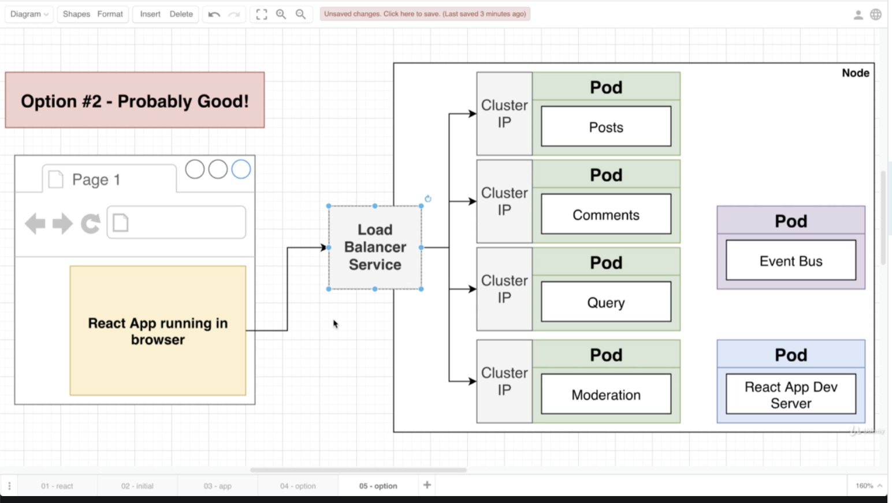

# Microservices deployment with k*83 demo

## services



### build backend services
```bash
# build and push images
cd comments
docker build -t nnonsung/comments-nodejs .
docker push nnonsung/comments-nodejs

cd moderation
docker build -t nnonsung/moderation-nodejs .
docker push nnonsung/moderation-nodejs

cd posts
docker build -t nnonsung/posts-nodejs .
docker push nnonsung/posts-nodejs

cd query
docker build -t nnonsung/query-nodejs .
docker push nnonsung/query-nodejs

cd event-bus
docker build -t nnonsung/event-bus-nodejs .
docker push nnonsung/event-bus-nodejs
```

### run k8s locally
```bash
# create microservice's deployments and clusterIP services
cd infra/k8s
kubectl apply -f comments-deployments.yaml
kubectl apply -f posts-deployments.yaml
kubectl apply -f query-deployments.yaml
kubectl apply -f moderation-deployments.yaml
kubectl apply -f event-bus-deployments.yaml

# testing posts service locally with NodePort
kubectl apply -f posts-service.yaml

# then you can hit POST http://localhost:[service-port]/posts
# for example:
curl --location --request POST 'http://localhost:30712/posts' \
--header 'Content-Type: application/json' \
--data-raw '{
	"title": "New sadf"
}'
```